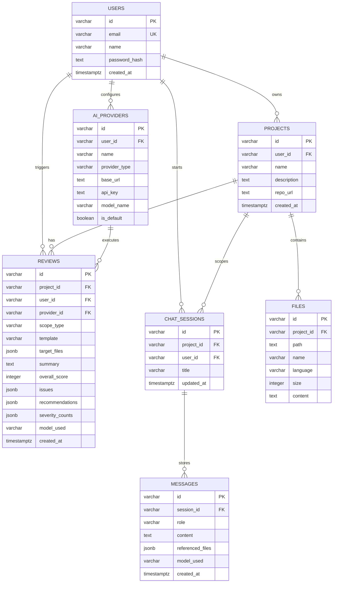
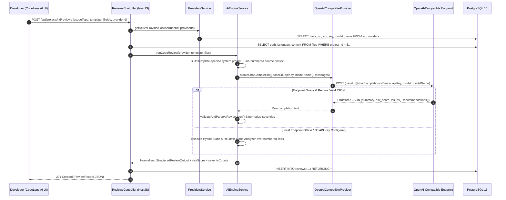

# System Architecture — CodeLens AI Code Review Assistant

This document explains the architectural design across the **Frontend (Next.js 14 + Tailwind CSS + Framer Motion)**, **Backend (NestJS 10)**, **Database (PostgreSQL 16)**, and **Configurable AI Integration Pipeline**.

---

## 1. Frontend Architecture (`frontend/`)

The frontend is built with **Next.js 14 (App Router)**, **TypeScript**, **Tailwind CSS**, and **Framer Motion**, engineered as a dark-first developer SaaS workspace (`#09090B` primary background, `#0F0F12` secondary background, `#141418` card surface, `#18181C` elevated surface, `#27272A` borders, `#8B5CF6` primary violet accent, `#A78BFA` AI accent) with `Inter` UI typography and `JetBrains Mono` code typography.

### Key Architectural Decisions
- **Reusable Design System (`src/components/ui/`)**:
  - `CodeLensLogo.tsx`: Custom geometric code-lens SVG mark with `CodeLens` + `AI` badge.
  - `Primitives.tsx`: Standardized `Button`, `Input`, `Badge`, `SeverityBadge` (`Critical`, `High`, `Medium`, `Low`), `Card`, `StatCard`, `Dialog`, `Skeleton`, `EmptyState`, and `InlineErrorState` components.
- **Global Application Shell (`src/app/page.tsx` & `src/components/CommandPalette.tsx`)**:
  - **240px Collapsible Left Sidebar**: Primary navigation (`Overview`, `Projects`, `Reviews`, `Chat` | divider | `AI Providers`, `Settings`) and bottom status footer (`● AI Connected` + user profile).
  - **56px Sticky Top Bar**: Brand mark, breadcrumb navigation (`Projects / Project Name / Files`), global `Search / Cmd K` trigger, `Help`, `Notifications`, and `User Avatar`.
  - **`Cmd/Ctrl + K` Command Palette**: Keyboard-navigable modal supporting `Create Project`, `Upload Code`, `Start Review`, `Search Projects`, `Search Reviews`, `Open AI Providers`, `Open Settings`, and `Open Chat`.
- **Modular Feature Views (`src/components/`)**:
  - `dashboard/OverviewView.tsx`: Greeting header, 4 compact stats (`Total Projects`, `Total Reviews`, `Critical Issues`, `Active AI Provider`), Recent Projects list, Quick Review launchpad, and Recent Reviews table.
  - `FileTreeExplorer.tsx` & `SyntaxCodeViewer.tsx`: IDE-style 260px file tree with search and checkboxes paired with a sticky-header code viewer supporting line numbers, word wrap toggle, inline severity annotations, and 1-click jump from any review issue.
  - `review/ReviewWorkflowModals.tsx`: `ConfigureReviewModal` (Scope, Review Type, AI Provider, Model, and live file/line scope estimation) and `AiReviewProcessModal` (4-step checklist: `Reading selected files`, `Preparing code context`, `Running AI analysis`, `Formatting findings`).
  - `ReviewInspector.tsx`: Radial SVG Risk Score (`0–100`) & Health Score gauge, Executive Summary, Severity breakdown (`Critical`, `High`, `Medium`, `Low`), Filter/Sort bar, and expandable Issue Cards (`Description`, `Code Snippet`, `Impact`, `Recommendation`, `Suggested Fix`, `Open File`, `Copy`, `Mark Resolved`).
  - `review/ReviewHistoryView.tsx`: Compact tabular review history with Project, Type, Severity, and Date (`7d`, `30d`, `All time`) filters.
  - `ChatWithCodePanel.tsx`: 2-panel `Ask your codebase` chat with Project Context file selector (`Select All` / `Clear`), quick prompt chips, and Markdown code blocks with copy buttons.
  - `providers/AiProvidersView.tsx`: Runtime management of OpenAI-compatible AI providers (`● Connected`, `○ Not tested`, `× Connection failed`, masked `••••••••••••••` API keys) and `SettingsView` (`Account`, `Security`, `AI Providers`, `Preferences`).
  - `BonusStudio.tsx`: **AI Diff Review** (LCS unified diff + quality score delta), **Architecture Analysis** (Mermaid topology + layer categorization), and **Documentation Generator** (`README.md`, `Setup Guide`, `API Documentation`).

---

## 2. Backend Architecture (`backend/`)

The backend follows **NestJS modular architecture**, separating HTTP transport controllers, domain services, authentication guards, database persistence, and AI execution, protected by a `SafeGlobalExceptionFilter` (`src/main.ts`) that prevents raw stack trace leakage.

```mermaid
flowchart TD
  AppModule["AppModule"]
  AppModule --> DatabaseModule["DatabaseModule (Global)\nPostgreSQL Pool + PGlite 16"]
  AppModule --> AuthModule["AuthModule (Global)\nJWT + Bcrypt + JwtAuthGuard"]
  AppModule --> UsersModule["UsersModule\nProfile & Password Updates"]
  AppModule --> ProvidersModule["ProvidersModule (Global)\nRuntime AI Provider Config"]
  AppModule --> AiModule["AiModule (Global)\nAIProvider -> OpenAICompatibleProvider"]
  AppModule --> ProjectsModule["ProjectsModule\nProject Lifecycle & Seeding"]
  AppModule --> FilesModule["FilesModule\nZIP / Drag-Drop / GitHub Import"]
  AppModule --> ReviewsModule["ReviewsModule\nReview Engine & Issue Resolution"]
  AppModule --> ChatModule["ChatModule\nContext Retrieval & Q&A"]
  AppModule --> BonusModule["BonusModule\nDiff Review, Architecture & Docs"]
```



### Module Responsibilities
1. **`DatabaseModule` (`src/database/`)**:
   - Exposes `DatabaseService.query(sql, params)` using parameterized `$1, $2` queries to prevent SQL injection.
   - Connects to external PostgreSQL via `pg.Pool` when `DATABASE_URL` is reachable, and automatically falls back to embedded **PostgreSQL 16 (`@electric-sql/pglite`)** persisted on disk (`backend/data/pgdata`) when running locally without a Postgres daemon.
2. **`AuthModule` (`src/auth/`) & `UsersModule` (`src/users/`)**:
   - Hashes passwords with `bcryptjs` (10 salt rounds), signs 7-day JWT access tokens, and supports updating user display name/email (`PATCH /api/users/profile`) and password (`PATCH /api/users/password`).
   - Protects all workspace controllers via `JwtAuthGuard` and injects the authenticated user via the `@CurrentUser()` parameter decorator.
3. **`ProvidersModule` (`src/providers/`)**:
   - Manages per-user AI provider records (`base_url`, `api_key`, `model_name`, `is_default`).
   - Strictly masks saved API keys as `••••••••••••••` in API responses so secrets are never leaked back to the browser after saving.
4. **`FilesModule` (`src/files/`)**:
   - Enforces a 50 MB archive limit and `isUnsafePath()` validation to block ZIP path traversal (`../`) attacks, filters out `node_modules/`, `.git/`, lockfiles, and binary assets, detects programming languages from file extensions, extracts `.zip` buffers via `adm-zip`, fetches public GitHub repository archives via `codeload.github.com`, and constructs the hierarchical `FileTreeNode[]` structure.
5. **`ReviewsModule` (`src/reviews/`)**:
   - Orchestrates single-file, multi-file, and full-project reviews across the `security`, `performance`, `quality`, and `comprehensive` templates, calculates `riskScore` and `overallScore`, supports marking individual findings as resolved (`PATCH /api/reviews/:id/issues/:issueId`), and serves searchable review history.
6. **`ChatModule` (`src/chat/`)**:
   - Implements a lightweight context retrieval ranker that scores project files by explicit user pins, path/filename match, and keyword frequency before calling `AiEngineService`.
7. **`BonusModule` (`src/bonus/`)**:
   - Computes Longest Common Subsequence (LCS) line diffs for **Diff Review**, analyzes layered module topology and imports for **Architecture Analysis**, and synthesizes **README / Setup Guide / API Documentation**.

---

## 3. Database Design (PostgreSQL 16)

The schema (`backend/sql/schema.sql`) uses 7 normalized tables with foreign key `ON DELETE CASCADE` constraints and `JSONB` columns for structured AI outputs.



---

## 4. AI Integration Flow (`AIProvider` Abstraction)

The AI layer follows a clean abstraction hierarchy:
`AIProvider` interface (`backend/src/ai/openai-compatible.provider.ts`) → `OpenAICompatibleProvider` → `AiEngineService` (`backend/src/ai/ai-engine.service.ts`) → `ReviewsService`.

Because it normalizes around the **OpenAI Chat Completions specification** (`POST {baseUrl}/chat/completions`), cloud providers (`OpenAI`, `OpenRouter`) and local inference servers (`LM Studio`, `Ollama`, `vLLM`) work identically without code changes.



### Prompt Engineering & Output Validation
1. **Line-Numbered Context Injection**: Every file sent to the model is prefixed with 1-indexed line numbers (`1: import ...`) so the LLM reports accurate line numbers in `issues[].line`.
2. **Template-Specialized System Prompts**: Each review mode (`security`, `performance`, `quality`, `comprehensive`) uses a dedicated persona and checklist so findings stay focused on the requested domain.
3. **Strict JSON Schema Validation & Hybrid Fallback**: `validateAndParseAiReviewJson()` strips optional markdown fences (` ```json `), validates severity enums (`Critical`, `High`, `Medium`, `Low`), and extracts `impact`, `recommendation`, `codeSnippet`, and `suggestedFix`. If a local server (`http://localhost:1234/v1`) is offline, `runStaticCodeReviewFallback()` performs deterministic line-by-line pattern analysis so the application remains 100% functional offline.
